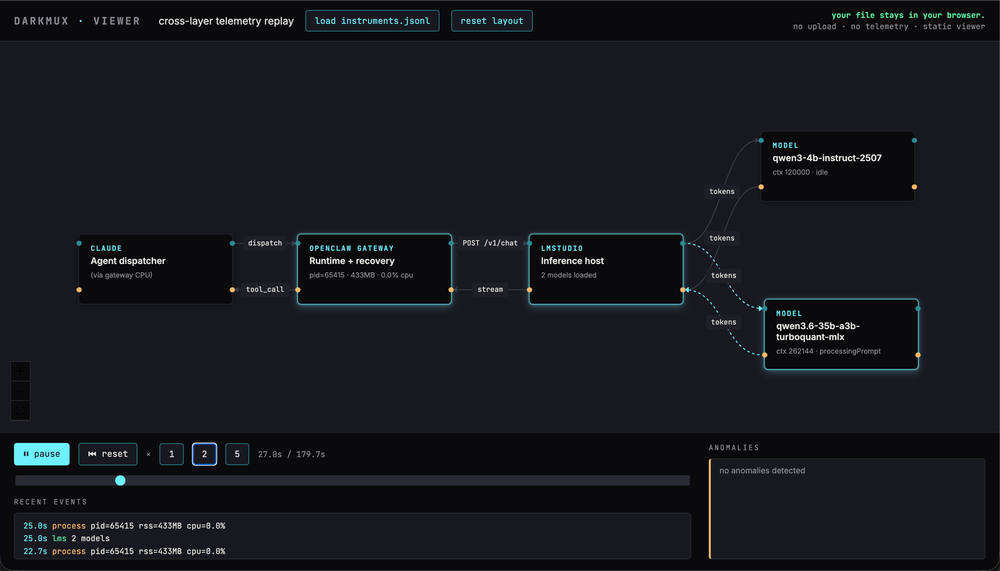

# darkmux

**[darkmux.com](https://darkmux.com) · Build a diverse local-AI team that complements frontier models — not competes with them.**

Task-class-aware multiplexer for local LLM configurations. Pick the right loaded model + context length + compaction profile for each task — automatically. Designed for agentic local-AI workflows on LMStudio (and Ollama / llama.cpp via the same OpenAI-compatible surface).

> **Heads up — read before running.**
> darkmux orchestrates AI tools that execute on your machine. It modifies your local config files (`~/.openclaw/openclaw.json`), sends commands to your local LMStudio server, and — in lab mode — runs AI-generated code in a working directory that is **not a security sandbox**. AI agents can behave unexpectedly. Use it on a machine where that is acceptable. Performance numbers in this README and in the accompanying articles are measured on the author's hardware (M5 Max, 128 GB) and will differ on yours. See [DISCLAIMER.md](./DISCLAIMER.md) for details. MIT licensed, no warranty, use at your own risk.

## What darkmux is for

Local AI is good at things frontier models aren't — fast iteration, repeatability across hardware, an offline foundation. darkmux exists to make frontier models *better* by giving them complementary teammates running locally. **Diversity-as-synergy, not replacement.**

**The bet.** Faster and better LLM results require solving the *harness* problem, and go hand-in-hand with the *modeling* problem. Articles 1 and 2 of [the series](https://darklyenergized.substack.com) measured this — the same model on the same machine ranged from 25 minutes to 5 minutes depending on which compaction settings the operator chose. darkmux is the engine that captures that knowledge.

**The arc.**

- **[Part 1](https://darklyenergized.substack.com/p/can-a-35b-local-model-write-your)** — sweep many models on the same workload, pick a few that work locally.
- **[Part 2](https://darklyenergized.substack.com/p/part-2-charting-the-wake)** — tune the knobs scientifically; get the most out of the right model.
- **Part 3** *(in progress)* — does the methodology produce better real work? darkmux as the tool that runs the loop on *your* hardware, not just the author's.

**The long view.** Once a local stack is optimized, the next step is collaboration — frontier, local, and specialized models on the same task. The optimizing agent (Claude, by default) is part of the team being optimized; it maintains the team's integrity as new models arrive and hardware changes. Optimization is not the destination — it's how the team stays sharp.

**Measurable goal.** A fresh frontier-model context, after a clean-slate `cargo install --path .`, should reach this same conclusion about darkmux's purpose without external prompting. If it doesn't, the docs (this README + `CLAUDE.md`) have drifted from the vision and that's the next thing to fix. See [#35](https://github.com/kstrat2001/darkmux/issues/35) for the maintainer's long-form answer.

## Quick start

### Prerequisites

darkmux orchestrates LMStudio + your agent runtime. Install these once:

| Required | Why | Install |
|---|---|---|
| **[LMStudio](https://lmstudio.ai/)** | Loads/unloads models. darkmux drives it via the `lms` CLI. | macOS / Windows / Linux installer |
| **At least one model in LMStudio** | Nothing to swap to without one. | Download via the LMStudio UI; verify with `lms ls`. |
| **Rust toolchain** | To build darkmux itself. | `curl --proto '=https' --tlsv1.2 -sSf https://sh.rustup.rs | sh` |

| Optional | When you need it |
|---|---|
| **An agent runtime** (e.g. [OpenClaw](https://github.com/openclaw/openclaw), Aider, Cline) | Only for the `lab` subcommand (workload dispatch, characterize, notebook). `swap`/`status`/`profiles` work without one. Override with `DARKMUX_RUNTIME_CMD=<your-runtime>`. |
| **[Claude Code](https://claude.com/claude-code)** | Only for the agent-invokable skills (`/darkmux-status`, etc.). darkmux as a CLI works without it. |

darkmux is developed and tested on Apple Silicon. Linux should work; Intel Mac is untested.

### Install + bootstrap

One copy-pasteable block — works from a fresh machine that has LMStudio installed:

```bash
# 1. Install Rust toolchain (skip if `cargo --version` already works)
curl --proto '=https' --tlsv1.2 -sSf https://sh.rustup.rs | sh
source "$HOME/.cargo/env"   # so this shell sees the new cargo immediately

# 2. Clone + build darkmux
git clone https://github.com/kstrat2001/darkmux
cd darkmux
cargo install --path .      # builds the self-contained binary, drops it on $PATH

# 3. Bootstrap config + agent skills
darkmux init                # creates ~/.darkmux/profiles.json + installs agent skills
```

If `cargo` is already on your PATH, skip Step 1. The `source "$HOME/.cargo/env"` line is the one most often missed by first-time-Rust users — without it, a fresh `cargo install` fails with `command not found: cargo` in the same shell that just ran the rustup installer.

### Verify your setup

```bash
darkmux doctor          # 7 pre-flight checks: registry, LMStudio, models, runtime, RAM, power
```

Doctor returns exit 0 if everything's wired up, 1 if a fail-level check needs fixing. Fail/warn lines include actionable hints.

Once doctor is green, edit `~/.darkmux/profiles.json` and replace each `<your-primary-model-id>` placeholder with an actual id from `lms ls`. (Doctor will warn if profiles don't match your loaded models — that's the moment to fix them.)

### First useful commands

```bash
darkmux profiles                  # list configured profiles
darkmux status                    # what's loaded; which profile (if any) matches
darkmux swap fast                 # swap to the "fast" profile (loads model into LMStudio)
darkmux lab characterize          # one-command "QA my Mac" — dispatch a smoke workload, get a verdict
darkmux lab run quick-q           # the smoke workload directly
darkmux lab runs --limit 5        # see your recent runs
darkmux optimize                 # guided "optimize for my workload" wizard (Phase 1 scaffold)
darkmux lab inspect <run-id>      # full per-run breakdown
darkmux notebook draft <run-id>   # ask the agent to author an EE-lab-style notebook entry
```

Using Claude Code? Run `darkmux init --with-claude-md ~/.claude/CLAUDE.md` to install the skills *and* teach Claude Code about darkmux at session start.

### Updating darkmux

After pulling new commits:

```bash
git pull
cargo install --path . --force
```

The `--force` flag tells cargo to replace the existing binary even when the source path or version metadata hasn't changed. Without it, cargo can silently skip the reinstall and leave you running an older binary while reporting the same `darkmux --version`. If a new feature (like `--instrument`) is missing despite a fresh `git pull`, that's the most likely cause — re-run with `--force`.

## Why this exists

Local-AI users hit a real workload-tax problem when they go agentic. A single static configuration can't be optimal across:

- **Bounded tasks** (TODO fills, single-turn reviews) — want a slim primary, no compaction overhead, fast decode
- **Long agentic tasks** (multi-file refactors, exploratory test authoring) — want big context to avoid compaction cliffs, even at the cost of bigger KV pre-allocation
- **Mid-range tasks** — want compaction-tuned middle ground

Empirical data behind this (from the work that motivated darkmux):

| Workload | Slim config (no offload, 32-64K) | Mid config (101K + 68K compactor) | Big config (262K + 120K compactor) |
|---|---|---|---|
| Bounded TODO | **60s** ✓ | 87s | 82s |
| Long agentic (n=6) | (would risk overflow) | 478s baseline | **mean 406s, fast 222s, slow 773s** |

Bigger context wins long tasks. Slim config wins bounded tasks. **No static config is optimal across both regimes** — but a router can be.

## What darkmux does

```
┌──────────────────┐
│  Agent / IDE /   │  (Claude Code, OpenClaw, Aider, Cline, Continue, custom)
│  Wrapper script  │
└────────┬─────────┘
         │ OpenAI-compatible HTTP
         ▼
┌──────────────────┐
│     darkmux      │  task classifier + LMStudio orchestrator
│   localhost:N    │
└────────┬─────────┘
         │ OpenAI-compatible HTTP
         ▼
┌──────────────────┐
│    LMStudio /    │  the actual inference
│    Ollama /      │
│   llama.cpp      │
└──────────────────┘
```

### Three layers

1. **`darkmux swap <profile>`** — bare CLI for users who classify themselves. Unloads/loads models in LMStudio according to a named profile. ~10s wall to swap.

2. **Multi-config registry** — a JSON file naming profiles (`fast`, `balanced`, `deep`) with model IDs, context lengths, compaction settings. Profiles can also encode "warm pair" (primary + companion compactor) configurations.

3. **`darkmux serve` (proxy mode)** — OpenAI-compatible HTTP frontend. Intercepts requests, classifies the task (heuristics first, optional LLM-classifier later), routes to the right loaded profile, swaps if needed.

Layers 1 and 2 ship from day one. Layer 3 is the smart-routing piece, optional.

## Why "darkmux"

- **dark** — Darkly Energized lineage (the experimental work that motivated it)
- **mux** — multiplexer (well-known engineering jargon for routing N → 1 or 1 → N)

OSS-published under personal GitHub: `github.com/kstrat2001/darkmux`. Darkly Energized is the brand context but darkmux is intentionally infrastructure (no commercial coupling).

The project is brand-aligned but doesn't claim "agents" — positioning matters because the agent-X namespace is saturated and confused. darkmux is infrastructure, not an agent.

## Design principles

1. **Compose, don't reinvent.** LMStudio already exposes load/unload via `lms`. Don't replace it; orchestrate it.
2. **Profiles are config, not code.** Named profiles in a JSON file. Add a profile by editing config, not by writing a plugin.
3. **Heuristic classification first, LLM classification later.** Free heuristics (prompt length, channel, agent role, file pattern) get most of the way without burning inference cycles.
4. **OpenAI-compatible everywhere.** Frontend, backend, and config syntax all use the established OpenAI surface so existing agents drop in.
5. **Honest about limits.** A router only beats static configs by routing correctly. We're explicit about what darkmux DOES NOT do (e.g., it doesn't make LMStudio faster; it makes the right LMStudio config available at the right time).

## Hardware profiles

darkmux ships with three Apple Silicon heuristics providers, tuned for different unified-memory tiers:

| Provider | Target RAM | Status |
|---|---|---|
| `m-series-128` | 96 GB+ (M Max / Studio Ultra) | ✅ Validated |
| `m-series-64` | 33–64 GB (M Pro) | ⚠️ Extrapolated from 128GB tier |
| `m-series-32` | up to 32 GB (Mac Studio / MBP) | ⚠️ Extrapolated from 64GB tier |

The `m-series-128` provider's rules are empirically validated against lab measurements. The 64 GB and 32 GB providers use conservative extrapolations — tune down `n_ctx` if you see swap pressure. Non-Apple-Silicon systems fall through to a generic fallback with unvalidated defaults.

## Runtime — agnostic by default

The `lab` subcommand dispatches workloads against an *agent runtime* — by default this is `openclaw` (the runtime darkmux was developed against). The runtime is invoked via:

```bash
DARKMUX_RUNTIME_CMD=<command>   # default: openclaw
```

If you set `DARKMUX_RUNTIME_CMD=aider` (or `cline`, or your own wrapper), darkmux invokes that binary instead with the same `agent --message` calling convention. Anything that exposes a single-shot `<cmd> agent --message <text> --json` surface is a candidate. The `swap` / `status` / `profiles` subcommands don't depend on the runtime at all — they orchestrate LMStudio directly.

When the runtime is openclaw (the default), `darkmux swap` and `darkmux doctor --fix` patch the openclaw config file in place. Path resolution: any profile's `runtime.config_path` wins; otherwise darkmux honors the `DARKMUX_OPENCLAW_CONFIG` env var; otherwise it falls back to `~/.openclaw/openclaw.json`. Set the env var if your openclaw lives somewhere non-standard:

```bash
export DARKMUX_OPENCLAW_CONFIG="$HOME/work/openclaw-staging/openclaw.json"
```

This means: **darkmux's profile-multiplexing is runtime-agnostic** today; the lab harness is *runtime-pluggable* via the env var. The empirical findings in the article series happened to be measured against OpenClaw; the routing thesis itself is independent.

### Cross-machine notebook (multi-environment lab notes)

If you run darkmux on more than one machine and want a single notebook that collates entries from all of them — for example, comparing wall-clock distributions across hardware tiers — point the notebook directory at an iCloud-synced (or otherwise shared) path:

```bash
export DARKMUX_NOTEBOOK_DIR="$HOME/Library/Mobile Documents/com~apple~CloudDocs/darkmux-notebook"
export DARKMUX_MACHINE_ID="m5-max-128gb-home"  # naming is yours; appears in entry headers
darkmux notebook draft <run-id>
```

Set the same `DARKMUX_NOTEBOOK_DIR` on each machine; give each a distinct `DARKMUX_MACHINE_ID`. Entries get tagged with their machine of origin in the header comment, so cross-machine readouts are unambiguous.

If `DARKMUX_MACHINE_ID` is unset, darkmux falls back to an auto-derived fingerprint (e.g. `apple-silicon-128gb`) — fine for casual use, but a named id is recommended when more than one machine of the same tier exists.

You can also override the machine id for a single draft via `--machine`:

```bash
darkmux notebook draft <run-id> --machine my-work-mac
```

To list all entries in the notebook directory (optionally filtered by machine):

```bash
darkmux notebook list           # all entries
darkmux notebook list --machine m5-home  # only this machine's entries
```

`notebook list` outputs columns: **date | machine | run | path** (aligned, newest first). The `--machine` flag filters to only entries matching that machine id.

## Instrumentation

`lab run --instrument` captures cross-layer telemetry alongside each dispatch — what LMStudio actually had loaded, where the gateway process sat across the run, and any anomalies (PID changes during active dispatch, loaded-model-set shifts, missing samplers). No root required.

```bash
darkmux lab run long-agentic --instrument
```

The flag adds a sidecar sampler that writes one JSON record per line to `~/.darkmux/runs/<run-id>/instruments.jsonl`. Each line has the shape:

```json
{"t": 1778466601846, "elapsed_ms": 0, "source": "meta", "payload": {...}}
```

Three sources:

- **`meta`** — sampler lifecycle events (start, cadence, version)
- **`lms`** — LMStudio's loaded-model snapshot from `lms ps --json` (identifier, context, status per model)
- **`process`** — gateway-process residency from `ps -p`: PID, port, CPU%, RSS

### Viewer

The companion viewer at [darkmux.com/viewer](https://darkmux.com/viewer/) replays a captured run as a four-block topology you can scrub through.



Drag your `instruments.jsonl` file onto the window. The topology renders:

- **Agent client** → **OpenClaw Gateway** → **LMStudio** runs left-to-right
- Loaded models branch off the right edge as separate nodes
- Edges fire as request/response samples come in — active model gets cyan-dashed edges, idle models stay grey
- The Anomalies panel surfaces inconsistencies (gateway PID changed during active dispatch, loaded-model set shifted mid-run, samples missing) — usually leading indicators of a misconfiguration worth investigating

The viewer is a static page served from this repo's `docs/` folder. **Nothing is uploaded.** Your `instruments.jsonl` is parsed entirely in the browser. No backend, no telemetry on the telemetry.

## Status

🚧 **Pre-alpha.** v0.1 (`swap`/`status`/`profiles`) and v0.2 lab foundation (`lab workloads`/`run`/`inspect`/`compare`) implemented. Real built-in workloads, notebook, and skills bundle pending.

## Why this exists — empirical motivation

Headline findings from the experimental work that produced darkmux's reference profiles:

- **Static config tuning has a floor.** Compaction knobs (`maxHistoryShare`, `recentTurnsPreserve`, `customInstructions`, compactor n_ctx) are tightly coupled — pulling any one of them in isolation regresses the run. Tuning at the config layer eventually stops paying dividends.
- **The "compactor loaded" tax is real.** Keeping a small compactor model warm for offload availability adds ~25s per dispatch on bounded workloads, even when compaction never fires. That cost is fixed and unrelated to compactor context size.
- **Long-task wins are bimodal.** With maximum primary context, multiple dispatches of the *identical* prompt + config split into a fast cluster (single-turn, no compaction fired) and a slow cluster (multi-turn, compaction fired). 3× variance between modes is normal — driven by emergent control-flow decisions inside the model's tool-loop, not by config.
- **Both modes still beat smaller-context baselines.** A router doesn't need to predict which mode a given dispatch will land in; it just needs to pick the right configuration for the *task class*.

The case for darkmux: **once you accept that static configs leave performance on the table — and that the right configuration depends on the task class, not the model — the routing layer becomes the highest-leverage piece of infrastructure missing from the local-AI stack.**

## Status

- ✅ v0.1: profile registry, `swap`/`status`/`profiles` CLI
- ✅ v0.2 foundation: `lab` subcommands, `WorkloadProvider` trait, `prompt` + `coding-task` providers, `quick-q` smoke workload
- 🚧 v0.2 next: real built-in workloads with sandbox seeds, `lab tune`, knob introspection
- 🚧 v0.3: notebook structure + agent-invocable skills
- 🚧 v0.4: team templates (workflow → fleet of agents → profiles)
- 🚧 v0.5: proxy mode (`darkmux serve`) with heuristic task classifier
- 🚧 v0.6: plugin system for community providers and templates

## License

MIT

## Author

Kain Osterholt — [@DarklyEnergized](https://x.com/DarklyEnergized) — Darkly Energized LLC
