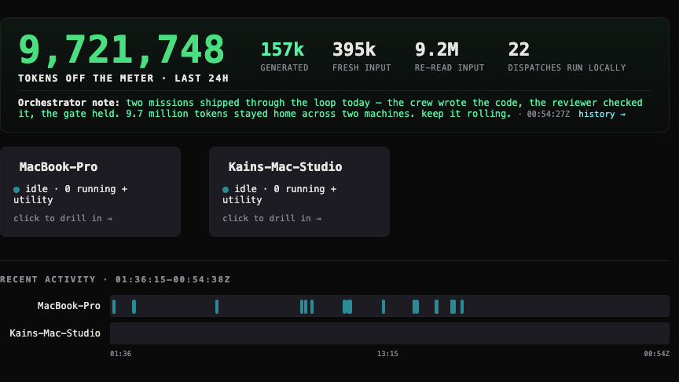

# darkmux

[](https://github.com/kstrat2001/darkmux/actions/workflows/ci.yml)
[](https://github.com/kstrat2001/darkmux/releases)
[](https://github.com/kstrat2001/darkmux/actions/workflows/quality.yml)
[](LICENSE)

**Own your AI workforce.** Run real engineering work on models you already have, on machines you already own. Off the meter.

darkmux turns a Mac (or a few of them on a tailnet) into a working local-AI fleet: config-defined **missions** run as live task graphs by a crew of role-staffed models. Every consequential step gates on your sign-off. Every dispatch leaves a record: which machine, which model, and why. Underneath it, a **lab** that measures what your hardware actually does, so your configuration rests on numbers, not vibes.

**[darkmux.com](https://darkmux.com) · [Live demo](https://darkmux.com/demo) — watch a real mission replay in your browser. Nothing to install.**

> **Read before running.** darkmux orchestrates AI tools that execute on your machine. It drives your local LMStudio server and, in lab mode, runs AI-generated code in a working directory that is **not a security sandbox**. AI agents can behave unexpectedly; use darkmux on a machine where that is acceptable. Performance numbers here and in the articles were measured on the author's hardware and will differ on yours. See [DISCLAIMER.md](./DISCLAIMER.md). MIT licensed, no warranty.

## Install

```bash
brew tap kstrat2001/darkmux
brew install darkmux

darkmux init      # config + profiles + agent skills (never overwrites)
darkmux doctor    # pre-flight: LMStudio, models, Docker, runtime, RAM
```

Local seats run on [LMStudio](https://lmstudio.ai/) (one downloaded model minimum). Any seat can instead be staffed by a hosted OpenAI-compatible endpoint: a machine with zero local models still runs full reviews. [Docker](https://www.docker.com/products/docker-desktop) hosts the dispatch runtime; the image pulls from GHCR on first use. Building from source, hub setup, updating, configuration: [docs/OPERATIONS.md](docs/OPERATIONS.md) · [full guide](https://darkmux.com/guide/).

## Your first mission

```bash
darkmux profile scan                  # match your downloaded models into profiles
darkmux lab characterize              # "QA my Mac": smoke workload in, verdict out
darkmux dispatch coder "add a smoke test for src/lib.rs"
darkmux mission launch review         # your working-tree diff, reviewed by a local crew
darkmux serve                         # live fleet view at http://localhost:8765
```

Every mission runs as a live task graph you can watch from any device on your tailnet, including your phone.



## What you get

- 🎯 **Missions, not chat.** Define work as config, launch it with one verb, watch it run as a task graph. Consequential steps stop and wait for your sign-off.
- 🤝 **A crew, not a model.** Roles (coder, reviewer, judge, scribe), each staffed by the right local model, or by a hosted endpoint when a seat needs frontier weights. Your registry, your call.
- 🔍 **PR review by local models.** `mission launch review` bundles the change, fans probe seats across it, double-confirms every finding with an independent judge, and posts an anchored review. darkmux [reviews its own PRs in public](.github/workflows/darkmux-review.yml) this way.
- 🧪 **The lab.** `darkmux lab run <workload>` captures wall clock, trajectory, and verify outcome on *your* hardware: baseline, change one knob, measure again. The [published findings](https://darklyenergized.substack.com) are re-runnable claims, not anecdotes.
- 📊 **A fleet you can see.** One live view across every machine: what's loaded, what's running, and what stayed off the meter. Phone-ready over your tailnet.
- 🔒 **Provenance by default.** Every dispatch emits a structured record (machine, model, role, mission). Opt-in BLAKE3 hash-chained audit log with edit detection, cron-friendly (`flow integrity-check` exits 2 on a chain break).
- 🖥️ **Editor-embedded** *(ships in 2.6)*: darkmux as a Zed agent over ACP — slash-command reviews, sign-off dialogs in the editor, and RADIO, the free-text voice on the console.

## What darkmux is for

The north star, in five claims:

1. **Optimization, not replacement.** Local models make your frontier assistant *better* by taking the work it shouldn't be burning budget on. Complementary teammates, not substitutes.
2. **Harness, then model.** Most "the model is bad" problems are harness problems. The same 35B on the same Mac ranged 25 minutes to 5 on one workload depending on configuration. Fix the harness first; darkmux is the harness.
3. **The lab and the loop.** Baseline → single-variable change → re-measure → record. Tuning discipline is the product, not a nice-to-have.
4. **Team integrity.** A fleet of identical 35B reasoners is not a team. darkmux keeps utility seats and specialist seats composed as models and hardware change.
5. **The recursive test.** A fresh session, given a clean install and these docs, should reach these same conclusions. If it can't, the docs have drifted — and that's a bug.

## The proof

darkmux exists because the [Genesis series](https://darklyenergized.substack.com) measured its way to it, in public:

- **[Genesis I](https://darklyenergized.substack.com/p/can-a-35b-local-model-write-your):** *Can a 35B local model write your unit tests?* Sweep the field, keep what works.
- **[Genesis II](https://darklyenergized.substack.com/p/part-2-charting-the-wake):** *Charting the Wake.* Configuration drift around the model matters more than the model.
- **[Genesis III](https://darklyenergized.substack.com/p/darkmux-genesis-iii-hybrid-by-design):** *Hybrid by Design.* What the operator–orchestrator–local-stack continuum looks like once it survives contact with real work.

## Honest limits

- **Local model server: LMStudio, today.** A second local backend (Ollama, llama.cpp) is deliberately unbuilt until a real one has a real user ([#316](https://github.com/kstrat2001/darkmux/issues/316)). Hosted endpoints are not the gap: any seat can run on an OpenAI-compatible cloud endpoint today.
- **Developed and dogfooded on Apple Silicon.** Linux compiles and passes CI's fleet tests, but nobody dogfoods it yet; Intel Mac is untested.
- **Built to be driven by a frontier orchestrator** (Claude Code or equivalent). Standalone CLI use works for scripting; orchestrator-driven is the design.
- **One operator, their own machines.** Not team tooling, not multi-tenant: a few Macs on a tailnet you trust. That's a focus, not a fence.

## Status

**v2.7.0** on the [Homebrew tap](https://github.com/kstrat2001/homebrew-darkmux), moving fast: breaking changes ship clean with migration notes, and every release is dogfooded on real work before it tags. Full history: [CHANGELOG.md](CHANGELOG.md).

## Security

Single-operator, local-first. Keep `darkmux serve` on loopback and treat AI-generated code like any untrusted script. Threat model and private reporting: [SECURITY.md](./SECURITY.md).

## License

MIT · Kain Osterholt · [@DarklyEnergized](https://x.com/DarklyEnergized) · Darkly Energized LLC

---

*Claude and Claude Code are trademarks of Anthropic PBC. LMStudio is a trademark of Element Labs Inc. darkmux is affiliated with neither.*
