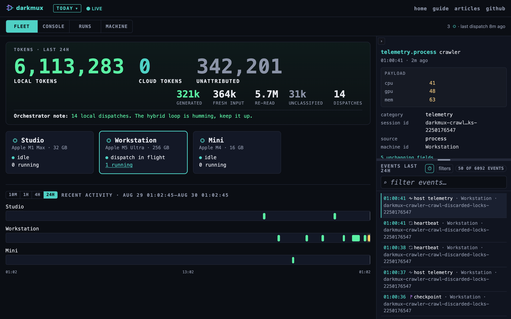

# darkmux operations manual

Everything the front-page README used to carry: full install paths, fleet
setup, configuration, the runtime's safety net, hardware profiles, and the
project's longer-form reasoning. Moved here (verbatim) when the README was
cut down to a landing page — nothing was deleted, it lives here and in the
[guide](https://darkmux.com/guide/).

> **Results will vary based on your frontier configuration.** The frontier models you use as the orchestrator need proper guidance to make the most out of darkmux. This README and the [user guide](https://darkmux.com/guide/) are a starting reference, not doctrine to enforce. Contradictory statements between this guide, your project's `CLAUDE.md`, and other frontier configs will cause more harm than good. Configure to your own strategy and goals; treat what's here as inspiration, not commandments. See [#112](https://github.com/kstrat2001/darkmux/issues/112) for the architectural reasoning.

## Who darkmux is for

Hobbyists building local-AI workflows on their own Macs. Individual engineers who want a serious agent stack running across the machines they already own. A few Macs over a tailnet (Tailscale, ZeroTier, WireGuard, your call) is the natural deployment shape: one operator who trusts every machine in their own fleet.

Not *designed* as team tooling or a multi-tenant platform. The technical surface (no auth on `DARKMUX_REDIS_URL` beyond what your mesh VPN already provides, operator-asserted provenance fields, cross-machine state on a shared substrate) assumes everyone reachable on the substrate is you. If team scope is interesting to you, the substrate is a reasonable starting point: fork it, layer in auth where you need it, and the project's design will likely benefit from the lessons. Bigger orgs have their own infrastructure for the multi-tenant problem, and darkmux stays focused on the one-operator-many-Macs case; that's not a fence, it's a focus.

## How darkmux runs

With just Docker + LMStudio, darkmux dispatches through its own built-in, container-bounded runtime: no external agent runtime to install or configure. This is the only dispatch path: `darkmux dispatch`, `darkmux lab run`, and the mission/phase lifecycle all run through it. (Earlier versions offered an opt-in shell-out to a separately-installed agent runtime; that path was removed pre-1.0 to keep the build and test surface small. See [#1405](https://github.com/kstrat2001/darkmux/issues/1405).)

See [DESIGN.md](DESIGN.md) for the implementation reasoning.

## Many machines become one

If you have more than one Mac, darkmux makes them work as a single development environment. Operator hands off a role to a named machine; that machine runs it if it trusts the sender. Open the topology viewer from any node and you see the whole fleet. Run `darkmux machine list` from any node and you see each machine's card: specs, RAM, loaded models, profiles, seats.

Concretely, the capabilities the multi-machine substrate ships today:

- **Machine-to-machine work submission (#2916).** `darkmux dispatch coder --profile <profile>@<machine>` sends the dispatch straight to that machine's fleet listener with the fleet token (the serve token); the machine resolves `<profile>` against its own registry. The receiver runs it only when the tailnet reports the sender as a node on its allow-list (`darkmux machine trust <sender> --profiles ...`) and the profile is in that entry's scope; otherwise it answers at once with the reason. Busy is per seat (one fleet job per local model, counting only jobs other machines send; hosted jobs up to the receiver's `remote.concurrent_cap`), and past that the receiver's `fleet.busy_policy` refuses or queues. The Redis work queue (`darkmux:work`) of earlier releases is retired, and so is `dispatch --machine`.
- **Fleet view.** `darkmux machine list` prints one row per roster machine with the card that machine states about itself (RAM headroom, loaded models, OS, darkmux version, profiles and whether darkmux manages their endpoints, seats, thermal state), fetched from each peer in parallel over the verified peer path (its fleet listener first, which also says what the peer accepts from this machine, then its daemon). Every daemon serves the same view at `GET /fleet/view` (#3004).
- **Decentralized flow UI.** The daemon hosts the observability viewer at its own origin: `http://localhost:8765/` on every machine running `darkmux serve`. The viewer pulls from the daemon's `/flow/<date>` endpoint which aggregates events from every machine writing to the shared `darkmux:flow` Redis stream, so you see the fleet, not just the host (#270 + #554).
- **`/darkmux-add-machine` skill.** Walkthrough for joining a new Mac to an existing fleet: env vars, roster setup, smoke test. Run `darkmux init` to install all skills locally (#176).

Deployment shape that this assumes: a couple of Macs on a tailnet you control (Tailscale, ZeroTier, WireGuard, your call), with Redis running on the always-on member. Redis is optional; without it, single-machine usage works fine and `LocalFileSink` captures provenance on disk per-machine.

If your hub machine drops off the network, the substrate degrades gracefully: flow writes fall back to `LocalFileSink`, dispatch bails loud with operator-actionable hints, `darkmux doctor` surfaces the degraded state, and the SSE Redis tail exits cleanly after a bounded number of failures rather than leaking spawned tasks. The verification discipline that matters here is "make sure your hub is hardened for the absences you plan": `pmset` config + Tailscale "Run at login" + auto-login user. macOS defaults assume "laptop closed = sleep"; that's wrong for a 24/7 hub.

### Seeing your fleet

The observability viewer is hosted by `darkmux serve` itself, not by the public site. Three URL patterns depending on what you're looking at:

| URL | Role | When to use |
|---|---|---|
| [`darkmux.com/demo`](https://darkmux.com/demo) | Demo with bundled sample scenario | First impression: see what the viewer does before installing anything |
| `http://localhost:8765/` | Your own daemon, live | Single-machine fleet, or local-only ops view on a multi-machine fleet |
| `https://<hub>.<your-tailnet>.ts.net/` | Hub's daemon via Tailscale Serve | Multi-machine fleet: load the hub's fleet view from any peer on your tailnet |

The third one is opt-in (the daemon binds localhost by default for safety). To expose it across your tailnet, see the [always-on hub guide → the cross-tailnet viewer](https://darkmux.com/guide/always-on-hub.html#viewer). Tailscale Serve is the recommended path: it terminates HTTPS at the tailnet node and proxies to the daemon, which stays bound to localhost. With read auth off (`serve.read_auth false`, the default) the proxied viewer loads freely, whether or not the machine holds a fleet token: the token is the execution credential (fleet work always needs it) and does not close reads. With `serve.read_auth true`, a proxied request is NOT treated as loopback: Tailscale Serve marks it with `X-Forwarded-For` (and `Tailscale-User-*`), so it needs the bearer token like any remote read, and a browser page-load, which cannot send one, gets 401 (#2988). "This machine" also needs a `Host` header naming the daemon (`localhost`, `127.0.0.1`, `[::1]` or the bound address), so a DNS-rebound page, or a browser reaching the daemon through a header-less proxy, is remote too. `Host` is client-set, so a non-browser client behind a TCP forward that adds no headers (`tailscale serve --tcp`) can send `Host: localhost` and cannot be told apart from this machine; for that setup use the HTTPS `tailscale serve` (it adds headers) or keep read auth on with a non-loopback bind. The `doctor` and `config-list` panels print the fleet listener's address, port and busy policy and the allow-list, so a tailnet viewer with read auth off sees every other panel but gets 401 on those two, unless it presents the token (#2988). Never bind the daemon to `0.0.0.0`: keep it on loopback and let the tailnet do the reaching.

## Quick start

### Prerequisites

**Out of the box, darkmux works with LMStudio + Docker.** Nothing else is required for the full dispatch + lab path. Other agent runtimes are opt-in.

| Required | Why | Install |
|---|---|---|
| **[LMStudio](https://lmstudio.ai/)** | Loads/unloads models. darkmux drives it via the `lms` CLI. | macOS / Windows / Linux installer |
| **At least one model in LMStudio** | Nothing to dispatch to without one. | Download via the LMStudio UI; verify with `lms ls`. |
| **[Docker](https://www.docker.com/products/docker-desktop)** | Hosts darkmux's internal Rust runtime, the default for `darkmux dispatch` and `darkmux lab run`. Each dispatch runs in a per-invocation `darkmux-runtime` container with kernel-enforced workspace isolation. darkmux pulls the version-pinned image from GHCR on demand (or `docker build --build-arg DARKMUX_VERSION=<version> -f runtime/Dockerfile -t darkmux-runtime:latest .` from the root of a source checkout at that version; a local image whose version label does not match the binary is skipped, #2923). **Required only for that dispatch + lab path:** the `machine` / `profile` read core needs only LMStudio + a model. | Docker Desktop or equivalent daemon |

> **`brew install` needs no toolchain.** Homebrew handles the build for you (and bottled binaries, once published, ship precompiled). The **Rust toolchain** is required only if you build from source (Option B below), which documents `rustup` at its first step.

| Optional | When you'd want it |
|---|---|
| **[Claude Code](https://claude.com/claude-code)** | The recommended way to drive darkmux. A frontier orchestrator (Claude Code, Cursor, Gemini, Antigravity, Codex, Copilot) operates the CLI verbs and the `/darkmux-*` skills; standalone CLI use works for scripting and cron, but orchestrator-driven dispatch is the design. |

darkmux is developed and tested on Apple Silicon. Linux should work; Intel Mac is untested.

### Install + bootstrap

**Option A: via Homebrew tap** (recommended; tap lives at [`kstrat2001/homebrew-tap`](https://github.com/kstrat2001/homebrew-tap)):

```bash
brew tap kstrat2001/tap
brew install darkmux                  # stable release
# brew install --HEAD darkmux         # or build from the latest commit on main

# Optional: hub posture (Redis as the coordination substrate)
brew install redis
brew services start redis

# Optional: run the daemon under launchd (KeepAlive + RunAtLoad)
brew services start darkmux
```

> **If `brew install` refuses with "untrusted tap":** newer Homebrew gates third-party taps behind an explicit trust step. Run `brew trust kstrat2001/tap` once, then re-run the install. (Older Homebrew versions don't require this and won't show the prompt.)

The brew formula installs both the `darkmux` binary AND a keychain-aware wrapper script (`libexec/darkmux-serve-wrapped`) that resolves `DARKMUX_REDIS_URL` from macOS Keychain at process-start, so the Redis password never lives in the launchd plist. See [the always-on hub guide](docs/guide/always-on-hub.html) for the production-grade setup.

**Scope of the brew install.** What you get: the `darkmux` CLI (dispatch, mission, machine, profile, flow, doctor, init), the `serve` daemon, the keychain wrapper, and the bundled skills. The `darkmux-runtime` Docker image that `darkmux dispatch` / `darkmux lab run` need is **not bundled in the formula** but you don't build it by hand: on the first dispatch with no local image, darkmux **pulls the version-pinned image from GHCR on demand** (`ghcr.io/kstrat2001/darkmux-runtime:<version>`, [#759](https://github.com/kstrat2001/darkmux/issues/759)). You just need Docker running. (A `runtime/` source checkout + `docker build` is the offline/dev alternative.) So the brew path is a complete install end to end: the `machine` / `profile` core, the hub posture (Redis + serve), **and** local dispatches.

**Option B: from source via cargo** (for dev work, contributors, or if you need the `darkmux-runtime` Docker image alongside the binary):

```bash
# 1. Install Rust toolchain (skip if `cargo --version` already works)
curl --proto '=https' --tlsv1.2 -sSf https://sh.rustup.rs | sh
source "$HOME/.cargo/env"   # so this shell sees the new cargo immediately

# 2. Clone + build darkmux
git clone https://github.com/kstrat2001/darkmux
cd darkmux
cargo install --path .      # builds the self-contained binary, drops it on $PATH

# 3. Build the internal-runtime container image (one-time, ~50 MB). The
#    build-arg stamps the version label; dispatch skips an image whose label
#    does not match the installed binary (#2923).
docker build --build-arg DARKMUX_VERSION="$(darkmux --version | awk '{print $2}')" \
  -f runtime/Dockerfile -t darkmux-runtime:latest .

# 4. Bootstrap config + agent skills
darkmux init                # writes ~/.darkmux/config.json + ~/.darkmux/profiles.json,
                            # installs agent skills (incl. /darkmux-bootstrap, a guided
                            # first-time setup workflow you run in your Claude Code
                            # session after install). Never overwrites existing files.
```

If `cargo` is already on your PATH, skip Step 1. The `source "$HOME/.cargo/env"` line is the one most often missed by first-time-Rust users. Without it, a fresh `cargo install` fails with `command not found: cargo` in the same shell that just ran the rustup installer.

### Verify your setup

```bash
darkmux doctor          # pre-flight checks: registry, LMStudio, models, runtime, RAM, power,
                        # flow substrate, audit integrity, model-pin drift, recommendation drift, …
```

Doctor returns exit 0 if everything's wired up, exit 1 if a fail-level check needs fixing. Fail/warn lines include actionable hints.

Once doctor is green, point your profiles at real models. The fastest path is `darkmux profile scan`: it lists the models LMStudio has downloaded that aren't yet in any profile and suggests which are worth adding, so you don't have to hand-match ids:

```bash
darkmux profile scan        # see downloaded models not yet in a profile, with suggestions
```

Or edit `~/.darkmux/profiles.json` directly and replace each `<your-worker-model-id>` placeholder with an actual id from `lms ls`. Either way, doctor will warn if profiles don't match your loaded models; that's the moment to fix them.

### Configuration

`darkmux init` also writes **`~/.darkmux/config.json`**, your one place to configure darkmux. It's self-documenting: every common setting is written with its default visible, so you tune the file instead of hunting through docs.

```json
{
  "machine_id": "studio",
  "lmstudio_url": "http://localhost:1234",
  "redis":   { "enabled": false, "host": "127.0.0.1", "port": 6379 },
  "audit":   { "enabled": false, "dir": "~/.darkmux/audit" },
  "runtime": { "inactivity_timeout_seconds": 600, "check_updates": true }
}
```

Optional integrations (Redis coordination, the audit log) are blocks you turn on by flipping `"enabled": true`; the connection knobs are already there to edit. Every setting also accepts a `DARKMUX_*` environment-variable override (handy for CI or a one-off shell); the precedence is **env var > `config.json` > built-in default**, and `darkmux doctor` shows where each value resolved.

**Secrets stay out of the file.** A Redis password is never written to `config.json`. It lives in the macOS Keychain (store it once: `security add-generic-password -a "$USER" -s darkmux-redis -w`), read at runtime and never logged. On non-macOS, pass a full `DARKMUX_REDIS_URL` instead.

> `config.json` (darkmux's settings) is a separate file from `profiles.json` (your profile registry). Point at a non-default profiles registry with `--profiles-file <path>` or `DARKMUX_PROFILES`.

### First useful commands

```bash
darkmux profile list                  # list configured profiles
darkmux machine status                # what's loaded; which profile (if any) matches
darkmux lab characterize              # one-command "QA my Mac": dispatch a smoke workload, get a verdict
darkmux lab run quick-q               # the smoke workload directly
darkmux run list --kind lab --limit 5         # see your recent runs
darkmux run inspect <run-id>      # full per-run breakdown
darkmux run stats <run-id> --json # derived metrics; the darkmux-lab-notebook skill drafts an entry from this
darkmux mission config list            # the mission configs you can launch
darkmux mission launch <id>            # mint + start a running mission instance from a config
```

Using Claude Code? Run `darkmux init --with-claude-md ~/.claude/CLAUDE.md` to install the skills *and* teach Claude Code about darkmux at session start. Then run **`/darkmux-bootstrap`** in your Claude Code session: it walks through detecting your hardware tier, registering profiles, and validating the end state. Operator-sovereign: the skill reads + proposes; you run the commands.

### Updating darkmux

**If you installed via Homebrew tap:**

```bash
brew upgrade darkmux                  # picks up the latest tagged release
brew services restart darkmux         # if you're running the daemon
```

For `--HEAD` installs, `brew upgrade --HEAD darkmux` pulls the latest commit on main instead.

**If you installed from source via cargo:**

```bash
git pull
cargo install --path . --force
```

The `--force` flag tells cargo to replace the existing binary even when the source path or version metadata hasn't changed. Without it, cargo can silently skip the reinstall and leave you running an older binary while reporting the same `darkmux --version`. If a new feature (like `lab fixture register`) is missing despite a fresh `git pull`, that's the most likely cause. Re-run with `--force`.

## Why this exists

The long-form answer is the [Genesis series](https://darklyenergized.substack.com) on Darkly Energized (three Substack posts that walk the genesis story end-to-end). The README is the short version.

**AI-first because today you'd be crazy not to.** Pre-AI, integrating a new source or structuring an unstructured intent meant writing a bespoke parser; tools for local-AI orchestration meant operators hand-authoring JSON for missions, phases, and profiles. With AI in the loop (specifically a small, fast, dependable *utility agent* loaded locally), that authoring tax mostly evaporates. darkmux dispatches utility agents internally for compaction, phase estimation, and (per [#113](https://github.com/kstrat2001/darkmux/issues/113)) mission proposal, so the operator gets structured output from vague intent without leaving the local tier. The frontier orchestrator stays on strategy; the utility agent absorbs the routine.

The other half of the answer is the original one: local-AI users hit a real workload-tax problem when they go agentic. A single static configuration can't be optimal across:

- **Bounded tasks** (TODO fills, single-turn reviews): want a slim primary, no compaction overhead, fast decode
- **Long agentic tasks** (multi-file refactors, exploratory test authoring): want big context to avoid compaction cliffs, even at the cost of bigger KV pre-allocation
- **Mid-range tasks**: want compaction-tuned middle ground

Empirical data behind this (from the work that motivated darkmux):

| Workload | Slim config (no offload, 32-64K) | Mid config (101K + 68K compactor) | Big config (262K + 120K compactor) |
|---|---|---|---|
| Bounded TODO | **60s** ✓ | 87s | 82s |
| Long agentic (n=6) | (would risk overflow) | 478s baseline | **mean 406s, fast 222s, slow 773s** |

Bigger context wins long tasks. Slim config wins bounded tasks. **No static config is optimal across both regimes.** But a router can be.

## What darkmux does

darkmux is a CLI binary, not an HTTP proxy. Your frontier session (Claude Code) invokes `darkmux` verbs directly to operate four substrates:

1. **Mission + phase orchestration.** `darkmux dispatch <role>` invokes a per-role-pinned agent (coder, code-reviewer, crawler, …) via the in-house container-bounded runtime. `darkmux mission launch <config>` mints the running mission instance and drives it as a task graph, gated on operator sign-off, finalizing into a typed envelope. Each dispatch emits a flow record carrying provenance: `machine_id`, role, model, mission, phase.

2. **Model residency (internal).** A dispatch loads the models a named profile in `~/.darkmux/profiles.json` declares, under the resident RAM budget, and unloads to make room when the budget requires it. This is the old profile multiplexer, now an internal capability: you declare profiles, darkmux loads them at dispatch time. The `swap` verb that used to drive it by hand is retired. `~10s` wall to load.

3. **Flow substrate.** Every dispatch, decision, and review is recorded as a structured JSONL event. `LocalFileSink` (always-on) writes to `~/.darkmux/flows/`. `AuditFileSink` (opt-in via `DARKMUX_AUDIT_DIR`) adds a BLAKE3 hash chain whose edits `flow integrity-check` detects (un-anchored: detects edits absent a full re-chain). `RedisSink` (opt-in via `DARKMUX_REDIS_URL`) adds a cross-machine coordination stream. `darkmux flow status` introspects the substrate; `darkmux flow integrity-check` walks the audit chain.

4. **Observability daemon.** `darkmux serve` is a local HTTP daemon (default bind `127.0.0.1:8765`) that serves the viewer at `/` plus flow records and mission/phase state as JSON. The route list, and the response type of each route, is in the [observability guide](guide/observability.html); routes and shapes are semver contracts, pinned by `crates/darkmux-serve/route-table.golden`. Foreground process: run in a separate terminal tab. `darkmux doctor` includes a `daemon: reachable` check; dispatches print a one-line stderr nudge when the daemon isn't reachable.

Both `dispatch` and `lab run` use the internal Docker-bounded runtime. The frontier session (Claude Code) orchestrates the whole thing: see the `/darkmux-bootstrap` skill for a guided walkthrough.

## Why "darkmux"

- **dark**: Darkly Energized lineage (the experimental work that motivated it)
- **mux**: multiplexer (well-known engineering jargon for routing N → 1 or 1 → N)

OSS-published under personal GitHub: `github.com/kstrat2001/darkmux`. Darkly Energized is the brand context but darkmux is intentionally independent (no commercial coupling).

The name comes from the multiplexer core: task-class-aware routing of LMStudio loadouts. That routing is still there, but it runs internally now; the project has grown into an AI-first local-AI orchestrator whose headline is the mission-and-lab pair, with small CLI primitives plus a few jobs the local model does internally (context compaction, routing `darkmux radio` requests). The AI-built-in verbs that used to sit here (`mission propose`, `lab notebook draft`) were removed in 4.0 (#2912/#2913): the frontier orchestrator writes a mission config or a notebook entry better than a small local model did. Earlier framings of darkmux as *"infrastructure, not an agent framework"* or as *"a profile multiplexer"* were honest at the time, but the binary today embeds AI dispatch logic internally and leads with missions, so calling it an AI-first orchestrator out loud is the honest move.

## Design principles

1. **Compose, don't reinvent.** LMStudio already exposes load/unload via `lms`. Don't replace it; orchestrate it.
2. **Profiles are config, not code.** Named profiles in a JSON file. Add a profile by editing config, not by writing a plugin.
3. **Heuristic classification first, LLM classification later.** Free heuristics (prompt length, channel, agent role, file pattern) get most of the way without burning inference cycles.
4. **OpenAI-compatible everywhere.** Frontend, backend, and config syntax all use the established OpenAI surface so existing agents drop in.
5. **Honest about limits.** A router only beats static configs by routing correctly. We're explicit about what darkmux does NOT do (e.g., it doesn't make LMStudio faster; it makes the right LMStudio config available at the right time).
6. **Config on an existing kind beats a new type.** Missions run as `Task`/`Step` graphs (`crates/darkmux-crew/src/step_kinds/`), and a `Step`'s `kind` is a registered Rust implementation. Before writing a new one, check whether the actual need is just new VALUES on an existing generic kind (`dispatch.internal`, `dispatch.single_shot`, `procedural.shell`, `procedural.noop`, the `builtins.rs` default). Only when the control-flow *shape* itself is genuinely new does it earn a new type, and even then: a reusable shape with a pluggable domain algorithm belongs in `step_kinds/patterns/` (e.g. the multi-pass-confirm and dedup-with-strategies patterns), while a genuinely single-purpose shape stays physically co-located with the mission module that owns it, not the shared crate. A team where every extension point compiles a new bespoke type is fighting the same "hard-wire every use case" failure mode this project exists to avoid at the model-orchestration layer. Don't let it recur at the code-extension layer.

## Hardware profiles

darkmux ships with three Apple Silicon heuristics providers, tuned for different unified-memory tiers:

| Provider | Target RAM | Status |
|---|---|---|
| `m-series-128` | 96 GB+ (M Max / Studio Ultra) | ✅ Validated |
| `m-series-64` | 33–64 GB (M Pro) | ⚠️ Extrapolated from 128GB tier |
| `m-series-32` | up to 32 GB (Mac Studio / MBP) | ⚠️ Extrapolated from 64GB tier |

The `m-series-128` provider's rules are empirically validated against lab measurements. The 64 GB and 32 GB providers use conservative extrapolations; tune down `n_ctx` if you see swap pressure. Non-Apple-Silicon systems fall through to a generic fallback with unvalidated defaults.

## Runtime

`darkmux dispatch` uses the **internal runtime** by default: an in-house Rust agent loop running inside a per-dispatch `darkmux-runtime` Docker container with a mounted workspace tempdir. Kernel-enforced workspace isolation, no cross-task context leak by construction. The image is small (~50 MB) and built once from `runtime/`:

```bash
# build the image once from the darkmux repo root, stamped with the version
docker build --build-arg DARKMUX_VERSION="$(darkmux --version | awk '{print $2}')" \
  -f runtime/Dockerfile -t darkmux-runtime:latest .
```

**Which image runs (#2923).** Dispatch reads the image's
`org.opencontainers.image.version` label with `docker image inspect` (nothing
runs) and uses a local `darkmux-runtime:latest` only when the label equals the
binary's version. Otherwise it runs the version-pinned
`ghcr.io/kstrat2001/darkmux-runtime:<version>`, pulling it if absent, and
prints which local image it skipped. An image with no label counts as a
mismatch. `--image darkmux-runtime:<tag>` names darkmux's own image and is
checked the same way: a mismatched or unlabeled one is refused before any
container starts, with the rebuild command. The container runs by the
checked image's id, so re-tagging during a dispatch cannot swap in another
image. A development build (a git checkout; `darkmux --version` shows a SHA)
shares its version number with the release, so when it falls back to the
release image it says so and names the build command for a matching one.
`darkmux doctor`'s `runtime image freshness` row shows what is on the
machine.

The `lab` subcommand mirrors `dispatch`'s contract: the internal runtime, no external agent runtime to install or configure. The `machine` / `profile` subcommands don't depend on any runtime at all. They read LMStudio and the registry directly.

This means **darkmux's dispatch path needs nothing beyond Docker + LMStudio**: `dispatch` ships with a self-contained internal runtime, so a new user never installs a second agent-runtime tool to get going. The empirical findings in the article series were measured against this runtime.

### Internal-runtime safety net + model-facing telemetry

The internal runtime watches each dispatch for the failure modes that waste local-AI time, and surfaces what it sees both to the operator (in the trajectory) and to the model (as `[darkmux-runtime]` system-message nudges, the *feedback-injection* channel). All detectors are observability-first: they record and nudge before they ever bail.

- **Struggle detectors.** Repeated identical tool calls (*cycle detection*), the same idea re-reasoned in a loop (*reasoning-loop detection*), a tool failing several times in a row (*tool-failure cascade*), and editing one file repeatedly without ever verifying (*cadence drift*). Each writes a trajectory event and, by default, a model-facing nudge.
- **Recovery paths.** Well-formed tool calls are *salvaged* when a turn hits the per-call token cap mid-output; runaway "reasoning with no action" turns are dropped, nudged, and retried (*intra-turn stall recovery*); and tool calls the model emitted as plain text instead of structured JSON are *promoted* back to real tool calls.
- **Budget + deadline.** The runtime watches each streamed call as it arrives and ends one only when its degeneracy check fires (#2836); a per-call cap on the wire remains as a backstop against unbounded emission; opt-in `--max-turns` / `--max-tokens` (env: `DARKMUX_RUNTIME_MAX_TURNS` / `DARKMUX_RUNTIME_MAX_TOKENS`) bound a whole dispatch; and an inactivity deadline (`DARKMUX_INACTIVITY_TIMEOUT_SECONDS`, default 600) fires a soft model-facing warning at 75% before the host hard-kills at 100%, resetting on any tool call or compaction.

Roles can override the nudge wording per signal via a `feedback_templates` block on the role manifest; operators can disable injection entirely with `DARKMUX_FEEDBACK_INJECTION=0`. The trajectory event reference lives in the `darkmux-analyze-run` skill.

### Lab notebook entries

darkmux does not write notebook prose itself. The bundled `darkmux-lab-notebook` skill (installed by `darkmux init` into your agent's skills directory) tells the frontier orchestrator how to draft an entry from a run's derived numbers:

```bash
darkmux run stats <run-id> --json   # what the skill reads; the manifest when it needs more
```

The entry goes wherever your own instructions say your notebook lives; the skill asks when they say nothing. If you collate entries across machines, set a distinct `DARKMUX_MACHINE_ID` on each (`darkmux doctor --verbose` shows the resolved id) and the skill stamps it into the entry header, so cross-machine readouts stay unambiguous.

(The `lab notebook draft`/`list` verbs, the `scribe` role, and the `DARKMUX_NOTEBOOK_DIR` / `dirs.notebook` setting were removed in 4.0, #2913. `darkmux doctor` names either setting if it is still set.)

## Instrumentation

Cross-layer telemetry is always-on (#557): no flag, no sidecar file. The internal runtime and dispatch emit it as `category=telemetry` flow records on the flow stream (sources: `lms`, `process`, `detector`, `runtime`, `context`, `compaction`), capturing what LMStudio had loaded, where the runtime process sat across the run, detector signals, and compaction events.

View it in the observability viewer the daemon serves: run `darkmux serve` and open `http://localhost:8765/`. The viewer reads live flow records straight from the daemon; there's nothing to drag and drop. A demo instance lives at [darkmux.com/demo](https://darkmux.com/demo).



## Why this exists: empirical motivation

Headline findings from the experimental work that produced darkmux's reference profiles:

- **Static config tuning has a floor.** Compaction knobs (`maxHistoryShare`, `recentTurnsPreserve`, `customInstructions`, compactor n_ctx) are tightly coupled; pulling any one of them in isolation regresses the run. Tuning at the config layer eventually stops paying dividends.
- **The "compactor loaded" tax is real.** Keeping a small compactor model warm for offload availability adds ~25s per dispatch on bounded workloads, even when compaction never fires. That cost is fixed and unrelated to compactor context size.
- **Long-task wins are bimodal.** With maximum primary context, multiple dispatches of the *identical* prompt + config split into a fast cluster (single-turn, no compaction fired) and a slow cluster (multi-turn, compaction fired). 3× variance between modes is normal, driven by emergent control-flow decisions inside the model's tool-loop, not by config.
- **Both modes still beat smaller-context baselines.** A router doesn't need to predict which mode a given dispatch will land in; it just needs to pick the right configuration for the *task class*.

The case for darkmux: **once you accept that static configs leave performance on the table (and that the right configuration depends on the task class, not the model), the routing layer becomes one of the highest-leverage pieces of infrastructure missing from the local-AI stack.**

**Shipped:**

- ✅ Profile registry + `profile list`/`profile scan`/`profile draft` CLI, with `machine status` for the loaded-state read (the founding `swap` verb retired in 2.0; gestalt manages residency)
- ✅ Lab subcommands (`run` + `run inspect`/`run compare`/`run list`, `characterize`/`tune`), `WorkloadProvider` trait, embedded smoke workloads, always-on cross-layer flow telemetry (#557)
- ✅ Lab reproducibility (#487): per-run copy-on-write sandbox isolation (source never mutated), `baseline_hash` + `final_hash` content hashing in the run manifest, a fixture registry with `lab fixture register`/`unregister`/`list` + `lab doctor` verbs, workload `requires_fixture` resolution, and `scripts/lab-init.sh` + the built-in `demo-tiny-py` fixture
- ✅ Lab run stats (`run stats`, derived metrics + reconciliation checks) feeding the `darkmux-lab-notebook` skill
- ✅ Agent-invocable skills bundle (12 skills including `/darkmux-bootstrap`)
- ✅ Crew + Role + Mission + Phase schema with SQLite-backed index; mission configs + `mission launch` as the config-launched instance-creation path
- ✅ Flow substrate: `LocalFileSink` (always) + `AuditFileSink` (BLAKE3 hash chain, verifiable via `flow integrity-check`; opt-in) + `RedisSink` (coordination; opt-in), composed via `TeeSink`
- ✅ `darkmux flow status` + `darkmux flow integrity-check` diagnostic verbs
- ✅ Observability daemon (`darkmux serve`) + `/flow` + `/lab` web viewers
- ✅ Doctor: 30+ pre-flight checks with actionable hints

**On the roadmap (active):**

- 🚧 Topology view in the web viewer (live + replay diagram of fleet activity; #169)
- 🚧 Fleet primitives (`darkmux machine add`/`darkmux machine list`) and cross-machine coordination (Phase 5 of #162)
- 🚧 Event-sourced mission state (Phase 8 of #162)
- 🚧 Sibling bootstrap skill: `/darkmux-enable-redis` (#178). (`/darkmux-add-machine` and `/darkmux-enable-audit` shipped, in the skills bundle above.)
- 🚧 Audit log management: `flow export`, `flow archive`, OS-level append-only flags for audit files
- 🚧 Multi-frontier orchestrator support (Gemini / Codex / Copilot bootstrap paths; #179)

**Aspirational (later):**

- 🚧 Plugin system for community-contributed providers, workloads, role manifests
- 🚧 Per-role bake-offs for non-SWE roles (trip-researcher, health-research, legal-research, …)
