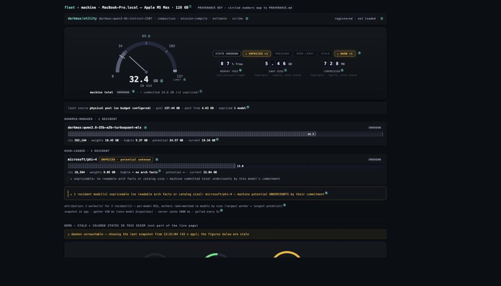

# Machine page provenance — where every value comes from

Every figure on the machine page traces to a probe on your own machine, through
a named transformation, to the pixel you see. This document is that trace,
**tested against a live daemon** rather than asserted: every row below was
re-verified on 2026-08-14 against a live `/machine/resources` +
`/machine/specs` pair on the operator's own machine, with the verification
method noted per row. This is operator sovereignty (#44) applied to the page
itself — the operator never has to wonder where a number came from.

The figures are one real snapshot and will not match your machine, or this
machine tomorrow — what is being asserted is the **identity** in each
"Tested" cell (Σ of these fields equals that field; this sysctl equals that
pixel), which is what re-verification actually checks.

**The two feeds:**

| Endpoint | Producer | What it carries |
|---|---|---|
| `GET /machine/resources` | `darkmux_profiles::model_ledger::gather()` — served by `machine_resources_handler` (`crates/darkmux-serve/src/lib.rs`), identical to `darkmux machine resources --json` | The memory ledger: residents, potential vs current, pool/limit, pressure, severity-tagged messages |
| `GET /machine/specs` | `machine_specs_handler` (same file) | Hardware line, machine identity, utility-tier model |

The gather runs **zero model dispatches** — it reads `lms ps --json` /
`lms ls --json` (LMStudio metadata), `vm_stat`, `sysctl`, and `ps` (kernel
counters), each under a bounded timeout. The client polls every 5 s
(`MACHINE_MEM_POLL_MS`, `ui/src/lib/queryKeys.ts`); the server caches the
gather for 2 s (`MACHINE_RESOURCES_CACHE_TTL`) so a poll burst costs one
gather. Both cadences are printed in the page footer ⑳ — cadence is a
recorded knob, never silent.



> **The key image predates both of this day's changes.** It still shows the
> decimal figures (`137`, `32.4 GB`) that finding 3 describes, and it circles
> as ② and ③ a `darkmux/utility` card that no longer renders at all — ② is
> now the small `utility` badge on a residency row. Every other circled
> number still maps to its row, which is what the image is load-bearing for;
> retake it when the annotated overlay is next regenerated.

## The trace, value by value

Byte figures render through `memBytes()` (`ui/src/lib/format.ts`): **binary**
GiB/MiB (`bytes / 2³⁰`, two decimals), and the gauge's glance layer through
`gaugeValueParts()` (same divisor, one decimal). Since #1811 that is the ONLY
convention on the page — see finding 3 for what it replaced and what is left.

**The copy-vs-data rule.** Not every string on a page like this came off a
probe — some is UI copy written by hand. Where the two sit next to each
other, **hardcoded copy must not render indistinguishably from a value that
was read**, because the promise above (every figure traces to a probe) is
falsifiable only if a reader can tell which strings are making it.

This page's current answer is stronger than a styling convention: it stopped
rendering the hand-written strings at all. The `darkmux/utility` card — whose
`handles  compaction · mission-compile · estimate · scribe` line was
hardcoded in the TypeScript, with no capability list on `/machine/specs` to
read (`utility_model` carries only `{id, loaded}`) — was deleted outright as
config rather than machine state. Its gloss survives as a `title` on the
badge at ②. Where live and static values do sit together in future, the
mechanism is brightness: a live value is `--fg`, hand-written copy stays
`--dim`.

The rule is stated here rather than assumed because the code cites it by
name (`memoryLedgerLines.ts` and its tests).

| # | The pixel says | Source | Transformation | Tested |
|---|---|---|---|---|
| ① | `Apple M5 Max · 128 GB` | `/machine/specs` → `cpu_brand` (sysctl `machdep.cpu.brand_string`), `ram_total_bytes` (sysctl `hw.memsize`) | `specOf()` (`lenses/fleet/cards.ts:65`): **binary**, `round(bytes/2³⁰)` — labeled `GB`, see finding 3 | 137438953472 / 2³⁰ = 128 ✓ — and ⑬ now reads `128.00 GiB` for the same field |
| ② | the small `utility` badge on one residency row | `/machine/specs` → `utility_model.id` + the row itself | `utilityModelId()` + `isUtilityTierRow()`: badges the row whose `identifier` **or** `model_key` is the configured id — mirroring the server's own two-field test (`m.identifier == id \|\| m.model == id`). Needs no `loaded` flag: a row exists iff `lms ps` lists the model, so the ROW is the residency claim and the badge only answers identity. Neutral, never a severity color — identity is not a verdict | badge present on exactly the 4b row live ✓; ledger rows == `lms ps` verified 3-for-3 ✓; inverted cases unit-tested ✓ |
| ④ | `32.9 GiB — IN USE` (odometer center + needle) | `/machine/resources` → `machine.current_bytes` | Σ of per-model attributed RSS (see *machine total* below); needle angle = `current / limit_bytes`, clamped at 100%. The odometer cells are centered on the hub with the unit hung outside that centering (`odoLayout`) | Σ model currents = 35357818880 = field ✓; 25.7% of scale ✓ |
| ⑤ | arc ticks `0 · 32 · 64 · 96` | `limit_bytes` | quarter marks of the scale, `limit × k/4` in whole **binary** GiB (`gaugeTickLabel`) | 128 × ¾ = 96 ✓ — decimal labeled this same arc `0 · 34 · 69 · 103`, finding 3 |
| ⑥ | `128 / LIMIT` at the max position (+ the redline end-cap) | `limit_bytes` + `limit_source` | limit resolution: `budget > physical pool > none` (`compute_ledger`, `model_ledger.rs:383`); word is LIMIT, or BUDGET when `limit_source:"budget"` | `limit == pool.capacity`, source `physical_pool` ✓; **budget arm currently unreachable — finding 4** |
| ⑦ | `╌ committed 42.06 GiB (+1 unpriced)`, or `╌ committed … (1 estimated)` since #1819 | `machine.potential_bytes`, `machine.unpriced_models`, `machine.estimated_models` | Σ of **priced** models' potential — this now includes ESTIMATED rows, not just measured ones (#1819); `unpriced_models` (genuinely unpriceable, uncounted) and `estimated_models` (counted, but via a labeled guess) are DIFFERENT facts and never collapse into one word — see "The #1819 estimate" below | Σ priced = 45163330707 = field ✓; count 1 ✓ |
| ⑧ | `UNKNOWN` state chip | `machine.state` | uppercased verbatim (`modelLines`/port uppercases the string, not CSS) | cascade verified — see *the state cascade* below |
| ⑨ | tell-tale lamps | `machine.state` (STATE), `unpriced_models` (UNPRICED), `pressure.red` (PRESSURE), fetch-failure + `generated_at_ms` age (STALE), `messages[]` filtered to `warn`/`error` severity (WARN — **#1821, was `warnings.length`**), `current ≥ limit` (OVER LIMIT — see PROPOSAL §redline) | each lamp keys on exactly one named field; lit = word + border + glow, never color alone. The WARN lamp's condition changed shape in #1821: an `info`-severity message (the #1819 estimate disclosure) no longer counts — only `warn`/`error` do, which is the actual fix to a working-as-designed disclosure lighting an alarm lamp | field values reproduce the lit set shown ✓; `alarmMessagesCount` unit-tested against a mixed-severity payload ✓ |
| ⑩ | `82 % margin — margin` (was `% free — memory free`) | `pressure.margin_percent` (renamed from `memory_free_percent`, #1821) | sysctl **`kern.memorystatus_level`** = `(capacity − wired − compressor) / capacity` — the kernel's own pressure headroom, 0–100. Sole red trigger: `pressure.red = level < 15` (`MARGIN_PERCENT_RED`, `model_ledger.rs`). **Renamed from "free" (operator-approved, #1821):** live, the same instant, this read 82% while truly-free pages read 30.8% — a 51-point gap under a label that implied "how much RAM is left". `margin` borrows this project's own NASA register (mass margin, power margin, propellant margin); the redline is where margin runs out | live sysctl read = 82 = field ✓; 82 ≥ 15 → `red: false` ✓; cross-checked against truly-free (30.8%) the same instant — finding 8 |
| ⑪ | `5.03 GiB — swap used` | `pressure.swap_used_bytes` | sysctl `vm.swapusage` (used), parsed by `parse_swapusage_used_bytes` | rendered = memBytes(field) ✓ — a monotonic high-water mark: reports, never alarms (by design, `model_ledger.rs:462`) |
| ⑫ | `1220 MiB — compressor` | `pressure.compressor_bytes` | `vm_stat` "Pages occupied by compressor" × page size | rendered = memBytes(field) ✓; same reports-never-alarms rule |
| ⑬ | `limit source · pool 128.00 GiB · used 64.54 GiB · available 67.06 GiB · unpriced` detail row (was `· pool free ·`) | `limit_source`, `pool.capacity_bytes`, `pool.used_bytes`, `pool.available_bytes`, `machine.unpriced_models` | **#1821 — a real machine-memory decomposition, one `vm_stat` read, zero added probe cost:** `used = wired + compressor_occupied + (active + inactive − purgeable)` (Activity-Monitor-style); `available = free + inactive + speculative` (the colloquial "how much is left" — the figure this row now leads with, in the slot `pool free` used to occupy); `free = "Pages free" × page size` (truly-free pages — kept in the payload as `pool.free_bytes`, deliberately NOT rendered in this row: two figures both reading "how much is left" was the defect finding 7 fixed, not something to preserve under a new label) | capacity/2³⁰ = 128.00 ✓, agreeing with ①; live `used` 69.3 GiB cross-checked against `top`'s ~66 GiB used, seconds apart ✓; `used + free` ≈ capacity (69.3 + 58.7 ≈ 128) ✓ |
| ⑭ | model name + `DARKMUX`/`USER` chip | `models[].identifier`, `.owner` | owner = namespace test `swap::is_darkmux_owned(identifier)` — the `darkmux:` prefix IS the ownership record | prefix ⇔ owner on both residents ✓ |
| ⑮ | `ctx · weights · kv@ctx · potential · current` | `models[].loaded_ctx`, `.weights_bytes`, `.kv_bytes_at_ctx`, `.potential_bytes`, `.current_bytes` | ctx from `lms ps`; weights from `lms ls` `sizeBytes`; the rest derived — see *per-model math* below | all identities verified ✓ |
| ⑯ | `UNPRICED · potential unknown` chip | `models[].potential_bytes == null` (the UI keys on this ONE field, `MachineHealthRegion.tsx`'s `pot == null` — `kv_per_token_bytes` staying `null` is a consequence of the same unreadable-arch-facts cause, not a second condition the component itself tests) | no readable arch facts AND no catalog size either → kv, potential stay `null`; the bar/dial draws **no committed extent** (absence, never zero). **Since #1819 this is the NARROWER case** — see "The #1819 estimate" below for the sibling `ESTIMATED` chip, which DOES draw a committed extent | a resident with no catalog entry either (the genuinely unpriceable case): all three null ✓ |
| ⑰ | `kv@ctx — no arch facts` | same null | `modelLines()` renders the reason, not a dash alone | ✓ |
| ⑱ | message text, severity-keyed | `messages[]` (renamed AND retyped from `warnings[]`, #1821 — `LEDGER_SCHEMA_VERSION` 1.1 → 2.0) | composed server-side in `compute_ledger`, each entry `{severity, text}` — `info` (a disclosure, e.g. the #1819 estimate note), `warn` (a real degradation, e.g. the unpriceable undercount), `error` (the reading itself is untrustworthy — a probe/enumeration failure). Rendered verbatim, never summarized, with the severity carried as a CSS class (`.memmsg-info`/`.memmsg-warn`/`.memmsg-error`) rather than one uniform amber treatment | text matches byte-for-byte ✓; severity round-trips through JSON ✓; an `info` message renders visually distinct from `warn`/`error` (component-tested) ✓ |
| ⑲ | attribution line | `attribution`, `attribution_note` | `attribute_current()`'s self-documenting degradation ladder (per-process RSS → rank-matched → estimated split → unavailable) | note matches live payload ✓ |
| ⑳ | `snapshot Ns ago · gather 438 ms (zero model dispatches) · server cache 2000 ms · polled every 5s` | `generated_at_ms`, `gather_ms`, `cache_ttl_ms` + client constant | the observer stamps its own cost into the payload — "the gather was negligible" is a verifiable claim, not an assumption | fields present; `gather_ms` 438–494 across polls ✓ |
| ㉑ | **the arc fill's color** (not circled in the key image — added 2026-08-14) | `machine.current_bytes` ÷ the scale — i.e. the needle's own position, and NOTHING else | `gaugeFillSeverity(pct)`: green < 50 ≤ amber < 85 ≤ red. **The one client-derived color on the page**, and deliberately so — see finding 1 | live fill `is-green` at 25.7% ✓; component tests pin an UNKNOWN-state payload rendering `is-red` at 94% and `is-green` at 3% ✓ |

## The derived values, expanded

**Per-model math** (`compute_ledger`, `model_ledger.rs:329-360`):

```
kv_bytes_at_ctx = kv_per_token_bytes × loaded_ctx
potential_bytes = weights + kv_bytes_at_ctx + 750 MB transient margin   (ArchEstimator)
```

Tested live: qwen3.6-35b at ctx 262,144 → 20480 × 262144 = 5,368,709,120 =
the field, and `potential − weights − kv` = exactly 750,000,000. The KV width
is **priced at fp16** (`KV_BYTES_PER_ELEMENT_V1 = 2`) until load-config
provenance (#1257) refines it — kv@ctx is an estimate with a stated width,
not a measurement.

**Machine total:** `current` is the Σ of attributed per-model RSS;
`potential` is the Σ of **priced** models — arch-measured AND
size-estimated (#1819) — with `unpriced_models` counting what the sum still
omits (the genuinely unpriceable remainder). The page must always carry the
`(+N unpriced)` tag with the committed figure — dropping it would turn an
honest undercount into a silent one. Since #1819 it must ALSO carry an
`(N estimated)` tag whenever `estimated_models > 0` — a different honesty
gap (counted, but by a labeled guess rather than a measurement) that must
not be silently folded into the "priced" bucket the way a reader would
otherwise assume it is.

**#1821 — darkmux is not the machine's only tenant.** Two new fields, both
emitted so the cascade's own arithmetic is checkable from the JSON, never
just trusted:

```
other_used_bytes      = pool.used_bytes − machine.current_bytes   (floored at 0)
projected_total_bytes = other_used_bytes + machine.potential_bytes
```

`other_used_bytes` is everything ELSE on the machine, right now. A missing
`current_bytes` (attribution unavailable) is treated as 0, which makes
`other_used_bytes` an OVERESTIMATE of other tenants rather than an
underestimate — the safe direction when darkmux's own share is unknown.
`projected_total_bytes` answers the question this cascade has always been
trying to answer: *if darkmux's own commitment fully materializes while
everything else holds what it holds now, what is the machine's total?*

**The state cascade** (`compute_ledger`, `model_ledger.rs`, in order — line
numbers drift with #1819/#1821's additions, so given by name rather than
pinned):

1. `pressure.red` → **Red**
2. `current_total > limit` → **Red** (this boundary is the redline's
   position — the display re-derives nothing; unchanged by #1821 — this arm
   is still darkmux's own current against the limit, not the projection)
3. `projected_total ≤ limit` **and** no unpriced residents → **Green**
   (**#1821 — was `Σ potential ≤ limit`**, which silently assumed darkmux
   was the machine's only tenant)
4. `projected_total > limit` → **Amber** (+ a shrink hint, itself now
   computed against `projected_total`, not `Σ potential` alone — a
   suggested cut has to close the REAL gap, including other tenants, or it
   would land exactly on the old target and still leave the machine over
   the limit)
5. under the limit on the *known* projection but with unpriceable
   residents → **Unknown** — no fit guarantee exists, and no shrink target
   is computable. Also reached when `other_used_bytes`/`projected_total`
   themselves are unreadable (`pool.used_bytes` missing, e.g. `vm_stat`
   failed) — the cascade never silently falls back to the pre-#1821
   darkmux-only comparison
6. no limit readable → **Unknown**

**Unchanged by #1819, and that is the load-bearing fact.** Arm 3's gate is
`unpriced_models == 0` — never `estimated_models == 0`. An estimated
resident's potential IS counted in `Σ potential` (and so in
`projected_total`), so it can carry the machine straight to Green (arm 3)
or Amber (arm 4) exactly like a measured one; it never forces arm 5. Only a
GENUINELY unpriceable resident (no arch facts and no catalog size —
nothing left to estimate FROM) still forces Unknown. See "The #1819
estimate" below for what changed and what deliberately did not.

Per-model tint then follows the machine state (shared-fate unified memory),
with one nuance: under machine-Amber, a model whose current has fully
materialized its potential shows Green (its commitment is already paid);
GENUINELY unpriceable models stay Unknown. An ESTIMATED row is priced, so it
carries no such exception — it follows the machine state like any other
row.

**Limit resolution:** `#1243 budget > physical pool capacity > none`
(`model_ledger.rs:383`). See finding 4.

## The #1819 estimate — the covenant's first exception

This document's opening line is a covenant: *every figure on the machine
page traces to a probe.* Until #1819, that was true without qualification —
a figure was either a probe's own reading, an arithmetic transform of one,
or absent. #1819 introduces the first figure on this page that is **neither
a probe reading nor absent**: a resident's `potential_bytes` can now be a
**labeled estimate**, computed from a catalog size the daemon DID read plus
a constant the daemon did NOT measure on this model.

**What triggers it.** `ArchEstimator` needs a resident's own `config.json`
to price it (`num_hidden_layers`, `num_key_value_heads`, `head_dim`,
`layer_types`). A GGUF download carries its architecture inside the binary
weights file instead of a sidecar `config.json`, so `ArchEstimator` comes up
empty — the exact trace this whole page's #1819 predecessor issue is built
from (`microsoft/phi-4` resolving to a GGUF with no `config.json`, while its
MLX sibling `mlx-community/phi-4-8bit` prices normally because MLX builds DO
ship one).

**The formula.** `ArchWithSizeFallback` (`model_ledger.rs`) tries
`ArchEstimator` first (a measurement); only when that returns `None` does it
fall to `V1Estimator`, then adds the SAME post-load transient margin
`ArchEstimator` already includes — the fallback and the measured path price
on one basis, never a cheaper one for the guess:

```
potential_bytes = catalog.size_bytes
                 + V1_FALLBACK_KV_BYTES_PER_CTX_TOKEN × loaded_ctx
                 + DEFAULT_TRANSIENT_MARGIN_BYTES
```

`V1_FALLBACK_KV_BYTES_PER_CTX_TOKEN = 204_800` bytes/token (204.8 KB/token,
decimal) — traceable, not invented, and traced to the exact model this
issue is ABOUT: `microsoft/phi-4`'s own architecture, published verbatim by
Microsoft (`huggingface.co/microsoft/phi-4/raw/main/config.json`, fetched
2026-08-15): `num_hidden_layers: 40, num_attention_heads: 40,
num_key_value_heads: 10, hidden_size: 5120` (`model_type: "phi3"` — Phi-4
reuses the Phi-3 architecture class; no `sliding_window`, no
`rope_scaling` — a homogeneous DENSE decoder). `head_dim = 5120 / 40 = 128`,
so `2 × 40 layers × 10 kv_heads × 128 head_dim × 2 bytes fp16 = 204_800`.

An earlier draft of this constant used the crate's #1286 devstral-24B
referent (163,840 B/token) instead — a real probed number, but one that
undershoots phi-4 itself by roughly 20%, which would have meant the
fallback UNDERPRICED the exact resident that motivated the feature, on the
very first machine it runs on. Deriving from phi-4's own published numbers
instead closes that gap for the model the issue traces; it remains a
REFERENT rather than a proven ceiling over every dense architecture
(caught in review, 2026-08-15 — see finding 7).

**The assumption, named where the covenant demands it.** This formula
assumes DENSE attention — every layer holds a KV cache. That is knowingly
wrong for a hybrid linear-attention model (the Qwen 3.5/3.6 generation,
#1286's own finding): those hold a KV cache on as few as 1 in 4 layers, so
pricing one at the dense rate OVERSTATES its true cost, sometimes 4× or
more. That is the deliberately chosen failure direction (#1819 decision 3):
this fallback only fires when the real architecture is unreadable, and
reserving MORE than a hybrid model actually needs is the safe mistake — the
alternative (assuming hybrid, underpricing a genuinely dense GGUF model)
is not.

**How a reader tells it apart on screen — every consumer of this figure,
named:**

| Surface | What changes |
|---|---|
| Row chip | `ESTIMATED` — a THIRD chip family alongside `.is-state` (outline+hue=status) and `.is-identity` (fill+grey=identity): `.is-estimated` is a DASHED outline in the neutral `--dim` hue, the one axis neither existing family had claimed. Title states the dense-attention assumption. |
| Row kv line | `potential ~10.69 GiB (estimated)` — the `~` and suffix travel WITH the number, not just beside it in a separate badge, so the figure can't be read (or copy-pasted) out of its own caveat. |
| Row hint | A `↳ estimated: …` line beside the row, mirroring the existing `↳ unpriceable: …` hint's shape and position. |
| Machine chip | `GREEN · 1 estimated` (decision 1 — an estimated resident MAY produce a decided verdict; the count travels with the word, `machineStateWord()`). Never prefixed `fit ` — that's a separate, still-open decision named explicitly in the code so a future edit doesn't confuse the two. |
| Machine detail row | `unpriced 0 models · estimated 1 model` — the SAME row that already named the unpriced count, extended rather than replaced. |
| `messages[]` | A dedicated `info`-severity message naming the estimated resident(s) and the assumption, SEPARATE from the existing `warn`-severity unpriceable-resident message — the two are different facts (counted-via-guess vs. genuinely-uncounted) AND different severities (a disclosure vs. a real degradation) and must never share one sentence or one lamp (#1821 — this is the fix to the WARN-lamp-lights-on-a-disclosure defect the estimate feature itself surfaced). |
| CLI (`darkmux machine resources`) | The row's STATE column carries `(estimated)`; the POTENTIAL column itself carries the same `~` prefix the kv line uses; the machine line's parenthetical names both counts when both are nonzero: `(+1 unpriced, 2 estimated)`. |
| Amber shrink hint | An estimated resident CAN be the shrink target — `hint_target_key`/`shrink_hint` read a row's kv rate through `effective_kv_rate()`, which uses `V1_FALLBACK_KV_BYTES_PER_CTX_TOKEN` for an estimated row rather than treating it as un-shrinkable (an earlier draft could render the FALSE "no shrinkable context" line when the estimated resident was the only one with room — caught in review). When the target itself is estimated, the hint's own saving figure carries a parenthetical noting it's computed from the same conservative assumption. |
| `darkmux doctor` | A dedicated check (`resident pricing`) names residents that are STILL genuinely unpriceable after the fallback — i.e. no catalog size either — and hints the concrete remedy (load an MLX build of the same model, when one exists). It does NOT warn on an estimated resident; estimation is the intended, working path, not a defect to flag. |

**What #1819 deliberately did NOT build.** Reading the GGUF header directly
would convert this from an ESTIMATE into a MEASUREMENT — strictly better
where it applies, since the real architecture genuinely lives inside the
file. That is a named follow-up issue, not built here: the size-based
fallback is the honest floor for every unreadable architecture in the
meantime, GGUF or otherwise, and never silently claims to be more than that.

**Addendum (#1820, 2026-08-15) — the GGUF-header follow-up landed.** This
section's own text above is left UNCHANGED — it is a dated record of the
#1819 decision, not a claim about today. What changed: `GgufFactsReader`
(`crates/darkmux-profiles/src/gestalt_host/gguf_facts.rs`) now parses a
GGUF download's own binary metadata header directly — `<arch>.block_count`,
`<arch>.attention.head_count_kv`, `<arch>.embedding_length` /
`<arch>.attention.key_length` — and feeds the result into the SAME
`ArchEstimator` a `config.json` reading does. `gather_with_bin`'s resolution
order is now `config.json` → GGUF header → the #1819 size-tiered estimate
above → genuinely unpriceable. Verified against the real
`lmstudio-community/phi-4-GGUF/phi-4-Q4_K_M.gguf` — this section's own
motivating trace: the header reader reproduces the exact `204_800`
B/token figure `V1_FALLBACK_KV_BYTES_PER_CTX_TOKEN` above was DERIVED from,
except now as a genuine per-model measurement (`potential_source: "arch"`)
rather than a tier estimate applied to that model. The `ESTIMATED` chip, the
`info`-severity message, and every other consumer in the table below are
UNCHANGED — they still fire, just now only for a GGUF this reader itself
can't parse (corrupt/truncated download, an ambiguous multi-file directory,
or a format neither reader understands), not for "GGUF" as a category.

## Findings

1. **`unknown` is the normal state on this machine, and that is correct —
   which is why the fill stopped keying on it.** The live snapshot takes arm
   5 above: the priced sum (42.06 GiB) fits the 128 GiB limit, but
   `microsoft/phi-4` is unpriceable, so the ledger honestly declines to
   promise a fit. Consequence: with any user-loaded model lacking readable
   arch facts, **the entire green/amber/red vocabulary is inert** — every
   state chip on the operator's real setup reads UNKNOWN.

   The page always rendered that truthfully, and *originally rendered it into
   the gauge too*: the arc fill carried `is-${machine.state}`, so the hero
   instrument swept from empty to full in permanent dim grey. Truthful, and
   useless — a gauge exists to show you the tank filling without reading a
   number, and this one had traded that away to re-encode a verdict three
   other elements already carried. The operator reported it from the live
   page on 2026-08-14 ("seems very grey... I was hoping it would have more of
   a color coded value as it fills up").

   The fix splits the two questions rather than guessing at either (row ㉑):
   **how full** is client arithmetic on two server numbers and says nothing
   about health; **what state** stays server-only, in the chip, the seven
   lamps, the face caption and the redline. An amber fill never means the
   arbiter said amber, and a component test pins exactly that — an
   UNKNOWN-state payload rendering a red fill while the chip still reads
   UNKNOWN and the redline stays dark. Making the *verdict* colored more
   often is still server-side work (pricing more models, or a partial-fit
   arm), never a client guess.

   **Addendum (#1819, 2026-08-15) — the "pricing more models" work named
   above landed.** This finding's own live snapshot is left UNCHANGED above
   — it is a dated record of what was true on 2026-08-14, not a claim about
   today. What changed: `microsoft/phi-4` is no longer unpriceable on a
   machine where it has a resolvable catalog size (it did, in that same
   snapshot — `9,053,136,497` bytes) — it now prices via the size-based
   `ArchWithSizeFallback` and shows `ESTIMATED`, not `UNPRICED`. The
   green/amber/red vocabulary is no longer permanently inert on a machine
   whose only unpriceable resident is a GGUF download with a catalog entry;
   it stays inert only for a resident with NEITHER arch facts NOR a
   resolvable catalog size — narrower, and rarer. See "The #1819 estimate"
   above for the mechanism and decision 1's own honesty requirement (the
   estimated count travels with the verdict everywhere it appears, so this
   fix could not simply repaint UNKNOWN as GREEN without saying why).

2. **`pool free` and `memory free %` disagree by design, and the labels hide
   it.** `pool.available` is `vm_stat` "Pages free" × page size —
   deliberately conservative, and macOS keeps free pages near zero by
   reclaiming everything into cache, so a couple of GiB on an idle 128 GiB
   machine is normal (1.84 GiB in this snapshot). `memory_free_percent` is `kern.memorystatus_level` — the
   kernel's own pressure headroom (0–100), not a byte count at all. Both are
   true; neither is "how much RAM is left" in the colloquial sense. The page
   keeps them in separate instruments (detail row vs pressure tile) with the
   tile labeled *sole pressure trigger*; a worthwhile follow-up is renaming
   the display labels (e.g. "free pages" / "pressure headroom") so the
   similarity of names stops implying comparability.

   **Addendum (#1821, 2026-08-15) — addressed.** This finding predicted
   exactly this outcome, and the operator declined the rename at the time
   because the argument then was GB-vs-GiB pedantry. A later live
   measurement made it a different case: the SAME instant, `pressure`'s
   tile read 82% while `pool free` read 30.8% — a 51-point gap under names
   that both implied "how much RAM is left". Three honest names now exist
   where two ambiguous ones did: `margin` (the renamed pressure tile —
   `kern.memorystatus_level`, not a byte count), `available` (NEW — the
   colloquial `free + inactive + speculative`, now the headline figure in
   the machine detail row), and `free` (the renamed byte-count field —
   truly-free pages, kept in the payload but deliberately not given prime
   space in the row: two figures both reading "how much is left" was the
   defect, not something a rename alone fixes if the row still shows both).
   See rows ⑩ and ⑬ above, and "The pool decomposition" below for the full
   derivation.

3. **The same physical quantity used to render as both `128 GB` and
   `137.44 GB` — fixed by moving the page to binary (#1811).** The header's
   RAM figure was binary (matching Apple's marketing number); every ledger
   figure was decimal (`memBytes`). Both derive from the identical
   `hw.memsize` = 137,438,953,472 bytes, so the page showed one quantity as
   two numbers — and the gauge inherited it, labeling its arc `0 · 34 · 69 ·
   103 · 137` on a machine everyone calls a 128 GB machine. The operator
   raised it against the live page on 2026-08-14: *"137 isn't going to make
   sense for a lot of users. we're all used to 128 powers of 2."*

   `memBytes`/`gaugeValueParts`/`gaugeTickLabel` are now binary and labeled
   `GiB`. The arc reads `0 · 32 · 64 · 96 · 128`, the ledger reads
   `128.00 GiB`, and the reconciling ` (128 GiB)` parenthetical that used to
   sit beside the pool figure is gone with the confusion it patched.

   **What remains:** `specOf` still labels its (always-binary) figure `GB`,
   so the header says `128 GB` where the ledger says `128.00 GiB`. Same
   number now — which is what the finding was actually about — but a
   mismatched suffix. Relabelling that one token is gated on retiring the
   machine stage's last byte-exact parity tie to legacy, so it stays an
   operator call. (A third figure, specs' `ram_free_for_ai_bytes` — doctor's
   reclaimable estimate minus residents — is **not rendered on this page at
   all**.)

4. **The BUDGET limit arm is currently unreachable in production.**
   `compute_ledger` fully supports `limit_source:"budget"`, but `gather()`
   passes `budget_bytes: None` with a comment naming the future wiring
   (`runtime.max_model_ram_gb`, #1243). The redesign's budget renderings
   (`96 / BUDGET` scale end, the budget demo gauge) are real code paths in
   the ledger but cannot occur from a live gather today — a server-side
   prerequisite, stated here so the mockup is not read as a claim about
   current behavior.

5. **No mismatches found.** Every arithmetic identity the page depends on
   verified against the live daemon: Σ current, Σ priced potential, kv@ctx,
   the 750 MB margin, the owner/namespace equivalence, the limit = pool
   equality, the state cascade's arm, and the red threshold (87 ≥ 15).

6. **Snapshots move.** Between the mockups' snapshot and this test's
   snapshot (same day, minutes apart): pool free 4.63 → 6.33 GB, compressor
   728 → 907 MB, gather 438 → 454 ms. Any static rendering of this page is
   one dated poll; the figures in the mockups are labeled with their
   snapshot date for that reason.

7. **#1819's own implementation shipped one real bug and one weaker-than-
   claimed constant, both caught by an independent review before merge —
   recorded here because the covenant this document keeps applies to the
   PR that adds the estimate too, not just to the feature once it's already
   in.**

   The bug: the first draft's fallback estimate omitted the 750 MB
   transient margin every arch-priced row already includes, so an
   ESTIMATED row priced 750 MB cheaper than a measured row with identical
   weights and ctx — making Green systematically EASIER to reach for a
   guess than for a measurement, the exact silent optimism this feature's
   whole framing is against. Fixed by adding
   `DEFAULT_TRANSIENT_MARGIN_BYTES` to the fallback arm, with a test
   pinning that an estimated row and an arch-priced row sharing weights,
   ctx, and kv rate now price byte-for-byte identically.

   The weaker-than-claimed constant: the first draft derived
   `V1_FALLBACK_KV_BYTES_PER_CTX_TOKEN` from the crate's #1286 devstral-24B
   probe (163,840 B/token) and asserted it "overstates" dense models in
   general. Independent verification against `microsoft/phi-4`'s own
   published `config.json` — the exact model this issue's trace names —
   found phi-4 itself costs 204,800 B/token, ~20% ABOVE the devstral
   referent. Re-derived from phi-4's own architecture instead ("The
   #1819 estimate" above has the arithmetic); the doc language was also
   softened to "a referent, not a proven ceiling" rather than an
   unconditional overstatement claim, since dense-model KV rates vary with
   head/layer geometry the same way #1286 first found for the hybrid case.

   Also fixed in the same pass: `estimated_models` gained `#[serde(default)]`
   (a required, non-`Option` field added in a MINOR schema bump breaks
   contract 5's lenient-on-read guarantee for cross-fleet reads without it
   — `darkmux machine resources <peer>` against an older machine would
   otherwise hard-fail and silently fall back to raw JSON); the amber
   shrink hint's target search was extended (`effective_kv_rate()`) so an
   estimated resident can be picked as a shrink target instead of
   potentially rendering a false "no shrinkable context" line; and the CLI
   table's POTENTIAL column now carries the same `~` prefix the UI's kv
   line does, so the caveat travels with the CLI figure too.

8. **#1821 — the machine-total cascade measured darkmux's commitment against
   the WHOLE machine's capacity, as though darkmux were the only tenant.**
   `Σ potential ≤ limit` (arm 3, pre-#1821) compares darkmux's own models
   against `hw.memsize`. Live: darkmux's committed ~42 GiB fit inside 128
   GiB — GREEN — while ~44 GiB was already held by other processes, so real
   headroom for darkmux was ~58 GiB, not 128. The verdict never looked at
   that.

   This is finding 2 one layer down: the pressure tile mislabeled darkmux's
   usage as the machine's; the cascade measured darkmux's commitment
   against the machine's whole capacity. The cascade is the one that
   matters more — it drives the chip, the lamps, the redline, and the
   whole green/amber/red vocabulary a reader actually trusts.

   Fixed by introducing `other_used_bytes` (everything else the machine is
   holding, right now) and `projected_total_bytes` (`other_used_bytes +
   Σ potential`), and rewriting cascade arms 3–4 to key on
   `projected_total`, not `Σ potential` alone — see "The state cascade"
   above. Verified NOT to flip the verdict on the operator's own machine at
   the figures the issue traced (used 69.3 GiB, darkmux current 36.78 GiB,
   darkmux potential 54.32 GiB → projected 86.8 GiB ≤ 128 GiB limit →
   still Green) — the fix corrects the ARITHMETIC the cascade performs, it
   does not by itself change today's verdict on a lightly-loaded machine;
   it changes the verdict on a machine where other tenants are large
   enough to matter, which is exactly the case arm 3 used to get wrong
   silently.

9. **`messages[]` replaces `warnings[]` — a rename AND a retype
   (`LEDGER_SCHEMA_VERSION` 1.1 → 2.0), because a disclosure and a
   degradation were rendering identically.** `warnings: Vec<String>` had no
   severity channel, so the #1819 estimate note — a disclosure, working
   exactly as designed, permanently true on any machine with a GGUF
   resident — lit the same amber WARN lamp as a genuine degradation (the
   unpriceable-resident undercount). `messages: Vec<{severity, text}>`
   with `info`/`warn`/`error` fixes the chip-color inconsistency the
   operator spotted, one layer below the color: the WARN lamp now keys on
   `warn`+`error` only. Named `info`, not `note` — `darkmux flow note` is
   an existing verb, and reusing the word would give one term two meanings
   in the same product (the same collision class as compactor/compressor,
   finding 2's sibling). Tolerable as a MAJOR bump: every consumer (CLI,
   `/machine/resources`, the viewer) ships in this same binary; no
   external reader is stranded.

## The pool decomposition (#1821)

All three pool figures come from ONE `vm_stat` read the gather already
performs — zero added probe cost, per this page's own observer-effect
constraint (constraint 1: zero model dispatches; this extends the same
discipline to zero added kernel probes).

```
used_bytes      = wired + compressor_occupied + (active + inactive - purgeable)
available_bytes = free + inactive + speculative
free_bytes      = free
```

`used_bytes` is Activity-Monitor-style. Cross-checked live against `top`
the same instant: 69.3 GiB from this formula vs `top`'s ~66 GiB used — far
closer than the implied `capacity - free` this page leaned on before
(73.4 GiB the same instant, and the reason `pool free` alone swung between
1.8 and 61 GiB across one earlier session: `free` is the most volatile of
the three page classes, since macOS reclaims aggressively into cache).

`available_bytes` is the colloquial "how much is left" — reclaimable
inactive and speculative pages counted as available, matching what a
person actually means by the phrase (the Linux `MemAvailable` / Activity
Monitor model). Neither `free_bytes` alone (too strict — charges ~26 GiB
of reclaimable pages as not-free) nor `margin_percent`
(`kern.memorystatus_level`, too generous — counts only wired+compressor as
"not available") answers this question; before #1821 it was not on the
page at all.

Every figure is parsed independently and degrades independently: a single
missing `vm_stat` label (an unfamiliar build, a truncated read) takes down
only the figures that need it, never panics, and never substitutes a
plausible-looking wrong number for a genuinely missing one.

## What in the mockups is synthetic

Stated so nothing implies API origin: the **demo strip** in every mockup
(stale banner, green/amber/red/over-limit gauges and their values), the
**scaling demo**'s departed/NEW/EXPECTED rows and its 46.6 GB machine figure,
and every `BUDGET` rendering (finding 4). The EXPECTED row additionally
depends on a server-side `expected[]` set that does not exist yet
(PROPOSAL §8). Everything else in the mockups is the live 2026-08-14
snapshot, transformed exactly as the table above describes.

---

*Verification artifacts: `live-resources.json`, `live-specs.json` (the tested
snapshots), `provenance.html` (the annotated page), `provenance-key.jpg` (the
keyed screenshot). Code references are to this worktree at the time of
writing; line numbers drift, function names rarely do.*
